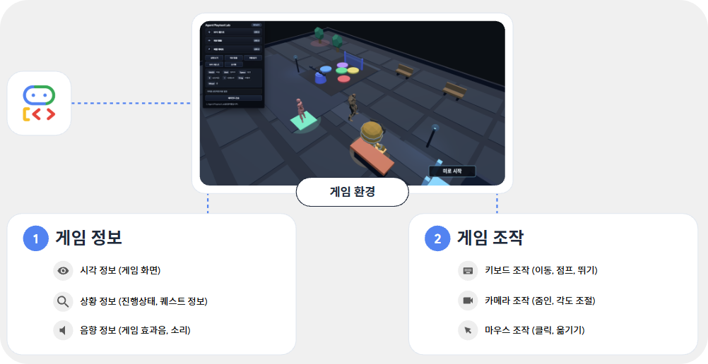
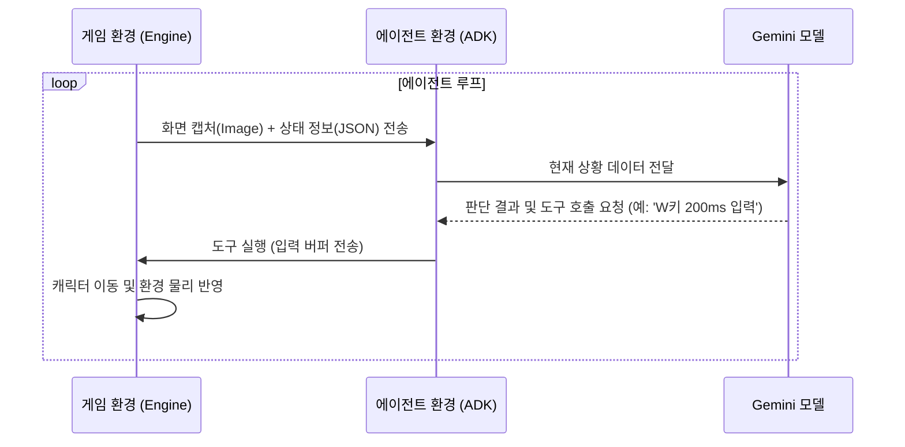
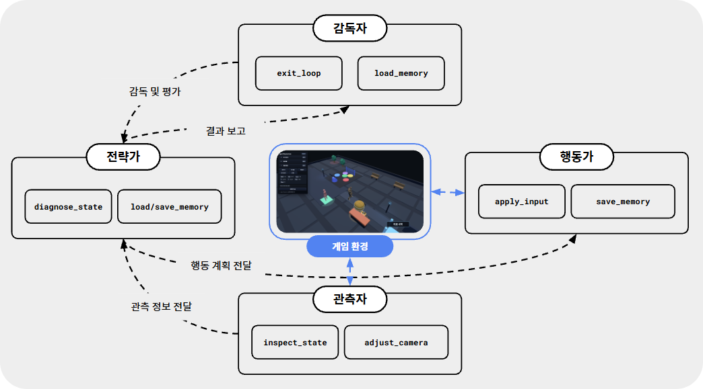
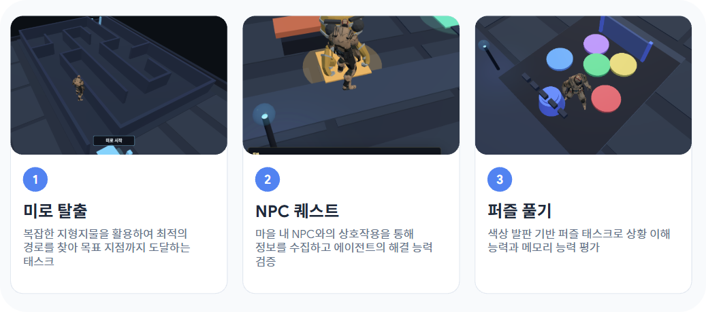
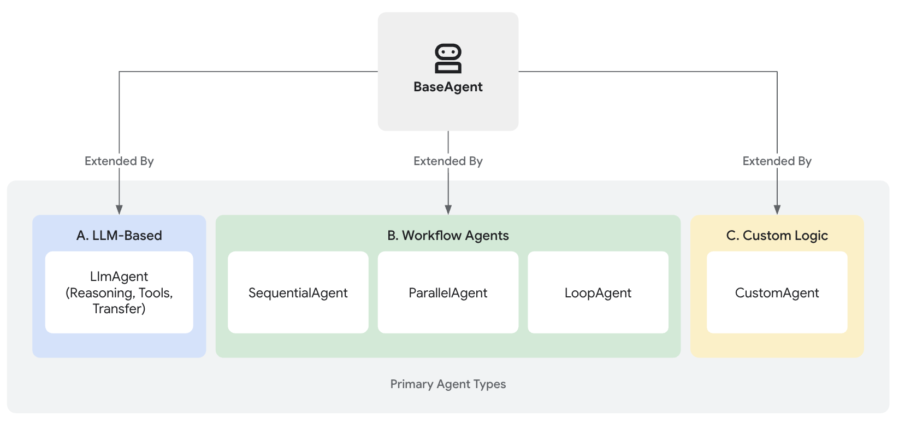
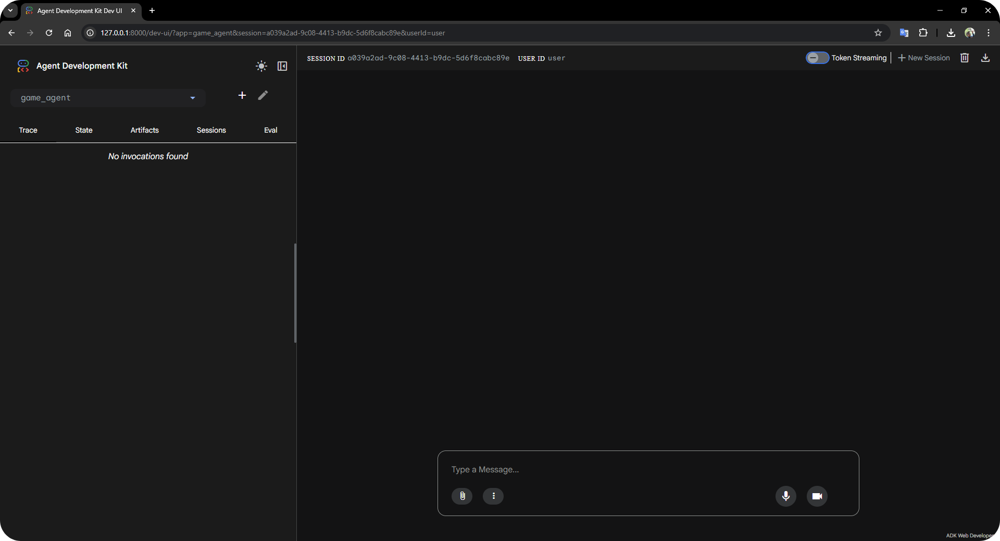
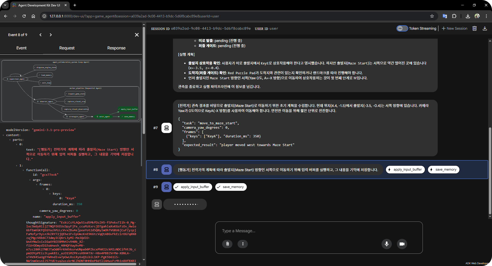
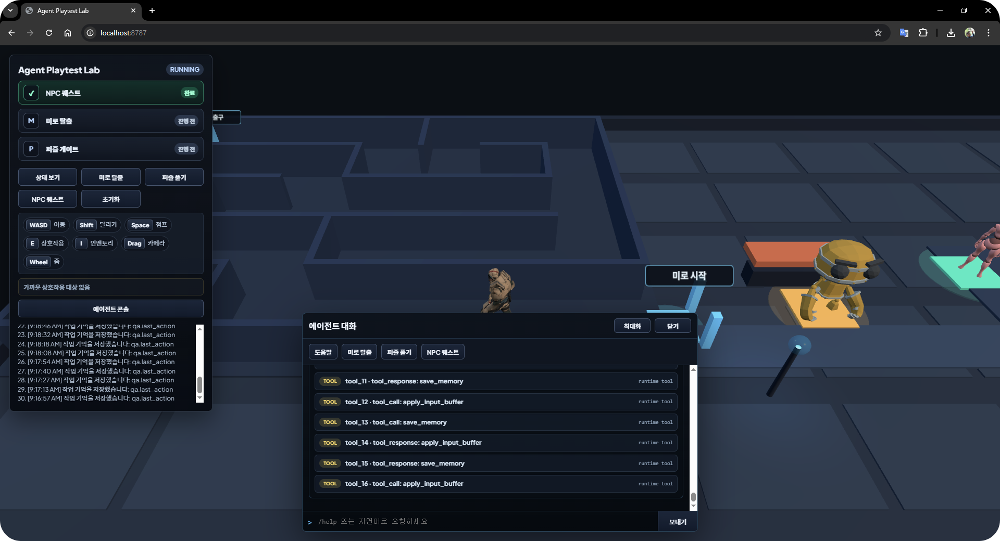

<h1 align="center">Agentic Game Lab</h1>

> [!TIP]
> 실습 시작 전, 전체적인 구성과 흐름을 파악할 수 있는 발표 자료를 먼저 확인해 보세요.
> - **발표 자료**: [Google Slides](https://docs.google.com/presentation/d/1ye2jJJvkK9n82YNF23Q1OwZqBn_8uawknZrPXY3alOk/edit?usp=sharing)

이 실습에서는 Google ADK와 Gemini API를 사용해 3D 게임 속 태스크를 해결하는 AI 에이전트를 함께 만들어 보려 합니다. 에이전트가 캐릭터의 위치 데이터를 직접 읽는 방식이 아니라, 사람이 게임을 하듯 화면과 텍스트 정보만으로 스스로 판단하고 움직이게 만드는 것이 목표입니다.

그럼 실습을 통해 어떤 것들을 얻을 수 있을지 하나씩 살펴볼까요?

### 전문 에이전트의 협업 구조 설계
감독자, 전략가, 관측자, 행동가로 구성된 4인 협업 시스템을 구축하고, 각 에이전트가 전문성을 발휘하여 복잡한 태스크를 해결하는 과정을 배웁니다.

### MCP 기반의 게임 조작 도구 연결
게임 엔진의 API를 에이전트가 이해할 수 있는 MCP(Model Context Protocol) 도구로 변환하여, 실시간 시각 정보 수집과 정교한 캐릭터 조작을 자동화하는 방법을 익힙니다.

### 자율 제어 루프와 전략 수정 로직
에이전트가 목표 달성 시까지 스스로 사고하고, 상황이 정체될 때마다 전략을 고쳐가며 반복 실행하는 자율 제어 루프를 직접 구성해 봅니다.

## 우리 시스템은 어떻게 작동할까요?
에이전트와 게임 엔진은 표준화된 MCP 인터페이스를 통해 데이터를 주고받으며, 체계적인 협업 루프를 통해 작동합니다.



1. **관측 및 분석**: 관측자 에이전트가 MCP 서버를 통해 게임 화면과 상태 데이터를 수집하여 팀 전체에 공유합니다.
2. **전략 수립 및 지휘**: 전략가가 상황을 진단하여 목표를 세우면, 감독자가 전체 흐름을 제어하며 작업을 배분합니다.
3. **조작 실행**: 행동가가 수립된 전략에 따라 실제 키 입력을 엔진에 전달하여 캐릭터를 움직입니다.
4. **피드백 루프**: 실행 결과를 다시 관측하여 성공 여부를 판정하고, 필요시 전략을 수정하며 목표 달성 시까지 반복합니다.

---

## 프로젝트 소개
Google ADK는 인공지능 모델이 다양한 도구를 사용해 스스로 작업을 수행할 수 있게 돕는 프레임워크입니다. 이번 실습에서는 Gemini 모델의 멀티모달 능력을 활용해 게임 플레이를 자동화하고 검증하는 과정을 함께해 봅시다.

### 에이전트란 무엇일까요?
ADK에서 에이전트를 구성할 때는 사용할 모델, 지침, 그리고 도구 목록을 결정해야 합니다. 아래 예시 코드를 보면서 구조를 익혀봅시다.

```python
# ADK를 활용한 에이전트 정의 예시
observer = LlmAgent(
    name="observer",
    model="gemini-3.1-pro-preview",
    instruction="게임 화면의 시각적 요소와 좌표 데이터를 분석하여 지형 및 장애물 상태를 보고합니다.",
    tools=[build_agent_toolset(["inspect_game_state", "capture_visual_observation"])]
)
```

이 코드는 에이전트의 지각 능력과 도구를 연결해 주는 역할을 합니다. 각 설정이 어떤 의미인지 알아봅시다.

- **model**: 에이전트가 상황을 분석할 때 사용하는 인공지능 모델입니다.
- **instruction**: 에이전트에게 내리는 행동 지침입니다. 어떤 규칙을 지키며 태스크를 수행할지 정의합니다.
- **tools**: 에이전트가 쓸 수 있는 함수 목록입니다. 상황에 맞춰 에이전트가 이 도구들을 스스로 골라 사용하게 됩니다.

### 게임에서 AI는 어떻게 활용될까요?
모든 게임 경로를 사람이 직접 테스트하는 것은 쉽지 않은 일이죠. 이때 자율 에이전트가 있으면 큰 도움이 됩니다.

- **화면을 직접 보고 이해합니다**: Gemini 모델은 게임 화면을 직접 보고 상황을 판단합니다. UI가 바뀌거나 시각적인 문제가 생겨도 사람처럼 감지할 수 있습니다.
- **쉬지 않고 테스트합니다**: 설정된 시나리오에 따라 미로를 탐색하거나 퀘스트를 수행하며 예외 상황을 찾아냅니다.
- **변화에 유연하게 대응합니다**: 게임 규칙이 조금 바뀌어도 지침만 수정하면 에이전트가 새로운 환경에 금방 적응합니다.

### 시스템은 어떻게 통신할까요?
에이전트와 게임 엔진은 서로 독립적으로 작동하며, 표준 인터페이스를 통해 데이터를 주고받습니다. 에이전트가 실제 사용자처럼 제한된 정보(화면, 로그)만으로 조작하는 과정을 시퀀스 다이어그램으로 살펴봅시다.



## 4인 에이전트 협업 시스템
복잡한 게임 환경을 더 효율적으로 테스트하기 위해, 전문 에이전트들이 팀을 이루어 일하는 구조를 만들었습니다.



각 에이전트가 어떤 역할을 맡고 있는지 확인해 봅시다.

| 에이전트 | 역할 | 모델 | 담당 업무 |
| :--- | :--- | :--- | :--- |
| **감독자** | 전체 상황 지휘, 제어 | Gemini 3.1 Pro | 전략가의 전략과 실제 실행 결과를 대조하여 성공 여부를 판정하고, 실패 시 개선 의견을 제시하여 전략가에게 피드백 전달 |
| **전략가** | 목표 수립과 진단 | Gemini 3.1 Pro | 관측 데이터와 엔진 진단 정보를 분석하여 최우선 행동 목표를 정의하고, 행동가가 실행할 가이드라인 설계 |
| **관측자** | 수집 및 관측 | Gemini 3.1 Pro / Flash | 게임 스크린샷과 상태 정보를 수집하여 객관적 지표로 변환. 시각적 힌트나 지형지물의 세부 특징을 포착하여 공유 |
| **행동가** | 액션 실행 | Gemini 3.1 Pro / Flash | 수립된 전략에 따라 실제 키 입력(WASD, Shift 등) 시퀀스를 설계하고, 물리적 충돌이나 저항을 최소화하며 캐릭터 조작 |

---

### 유연한 전략 수정 흐름 (5턴 주기)

에이전트가 복잡한 지형에서 길을 헤매거나 한곳에 계속 머물러 있는 상황을 방지하기 위해, 5턴마다 상태를 점검하고 전략을 수정하는 유연한 흐름을 도입했습니다. 감독자 에이전트가 캐릭터의 움직임을 관찰하다가 진행이 정체되었다고 판단하면, 현재의 전략을 과감히 포기하고 전략가에게 새로운 작전을 세우라고 지시합니다. 이러한 피드백을 받은 전략가는 막혔던 길이나 실패했던 방식을 기억에 남겨두었다가, 다음번에는 전혀 다른 접근 방식을 선택하며 태스크를 완수하게 됩니다.

---

### 에이전트 도구 분류
에이전트는 각자의 전문 분야에 맞춰 아래 도구들을 활용합니다.

| 분류 | 도구 | 기능 |
| :--- | :--- | :--- |
| **관측** | `inspect_game_state` | 실시간 스크린샷 캡처, 캐릭터 좌표, 주변 장애물, 기시 랜드마크 정보 수집 |
| | `diagnose_engine_state` | 내부 이벤트 트리거 상태, 물리 엔진 경고, 퀘스트 논리 구조 등 보이지 않는 기술 데이터 분석 |
| | `capture_visual_observation`, `capture_visual_crop` | 게임 내 상황을 분석하기 위한 화면 관측 (토큰 최적화를 위해 전체 시각 관측 및 부분 관측으로 나뉨) |
| | `adjust_camera_view` | 카메라의 각도와 줌을 변경하여 사각지대를 탐색하거나 전체적인 시각 정보 수집 |
| **조작** | `apply_input_buffer` | 키보드 입력(WASD, Shift, Space, E) 전송, 실제 이동 및 상호작용 수행 |
| **전략** | `load_memory` | 과거의 판단 및 기록을 기억에서 불러옴 |
| | `save_memory` | 현재의 판단, 새롭게 발견한 경로, 전략 수정 사항 등을 작업 기억에 기록 |
| **감독** | `load_memory` | 과거의 판단 및 기록을 기억에서 불러옴 |
| | `save_memory` | 현재의 판단, 새롭게 발견한 경로, 전략 수정 사항 등을 작업 기억에 기록 |
| | `exit_loop` | 모든 목표가 달성되었거나 더 이상 진행이 불가능할 때 에이전트 루프 종료 |

---

### 에이전트와 도구의 연결 구조 (MCP)
우리 시스템은 **MCP(Model Context Protocol)**를 기반으로 에이전트와 게임 엔진을 연결합니다. 각 파일의 역할을 이해하면 에이전트 구성을 보다 정확하게 처리할 수 있습니다.

- **McpToolset (`tools.py`)**: 에이전트가 사용할 도구 목록을 정의하고 관리합니다.
- **MCP Server (`mcp_server.py`)**: 에이전트의 도구 호출 명령을 게임 엔진이 이해할 수 있는 API 요청으로 변환합니다.
- **Runtime API (`src/engine`)**: 게임 엔진이 제공하는 실제 기능들입니다. MCP 서버는 이 API를 호출하여 도구 실행 결과를 받아옵니다.

---

### 실습에 유용한 ADK 명령어
터미널에서 아래 명령어들을 활용하면 에이전트의 상태를 더 깊이 있게 분석할 수 있습니다.

| 명령어 | 용도 | 상세 설명 |
| :--- | :--- | :--- |
| `adk web handson/` | 에이전트 분석 | 웹 인터페이스를 통해 에이전트의 사고 과정과 도구 호출 이력을 시각적으로 확인합니다. |
| `adk run handson/` | 즉시 실행 | 터미널 환경에서 에이전트를 직접 구동하여 동작 여부를 빠르게 테스트합니다. |
| `adk inspect handson/` | 구조 점검 | 정의된 에이전트의 계층 구조와 연결된 도구 목록을 한눈에 파악합니다. |

---

### 실습 기대 결과

에이전트 구성을 모두 마치면 게임 속에서 마주할 3가지 태스크를 스스로 해결할 수 있게 됩니다. 에이전트들이 어떤 활약을 펼치게 될지 함께 확인해 볼까요?



*   **미로 탈출**: 저기 탈출구가 보이네요! 복잡하게 얽힌 길과 장애물 사이에서 에이전트가 스스로 주변을 살피며 가장 빠른 길을 찾아 안전하게 빠져나가는 모습을 지켜봅시다.
*   **NPC 퀘스트**: NPC가 무언가 도움을 기다리고 있군요. 대화를 통해 NPC가 정말로 원하는 것이 무엇인지 파악하고, 필요한 아이템을 찾아 전달하며 태스크를 멋지게 해결해 봅시다.
*   **퍼즐 풀기**: 바닥에 숨겨진 힌트가 있는 것 같아요. 화면 속에 흩어진 시각적 단서들을 조합해 퍼즐의 비밀을 풀고, 장치를 조작하여 다음 구역으로 넘어가는 과정을 함께 경험해 봅시다.

---

## Google ADK 에이전트 구조

Google ADK는 복잡한 작업 해결을 위해 다양한 유형의 에이전트 조합 기능을 제공합니다.



### 에이전트 타입 요약

| 타입 | 설명 | 주요 특징 |
| :--- | :--- | :--- |
| **LLMAgent** | 기본 에이전트 | LLM 추론 능력을 직접 사용하여 도구 호출 및 응답 생성 |
| **SequentialAgent** | 순차 실행 에이전트 | 하위 에이전트들을 리스트 순서대로 실행 |
| **ParallelAgent** | 병렬 실행 에이전트 | 하위 에이전트들을 동시에 실행하여 작업 시간 단축 |
| **LoopAgent** | 반복 실행 에이전트 | 목표 달성 시까지 하위 에이전트를 반복 구동 |
| **CustomAgent** | 사용자 정의 에이전트 | 비즈니스 로직이나 제어 흐름을 직접 구현 |

---

## 준비 및 환경 설정

게임 서버와 에이전트 런타임을 로컬 환경에서 실행하기 위한 설정 단계입니다.

### 프로젝트 내부 구조와 실행 흐름
수정할 파일은 에이전트의 구성을 정의하는 설정 부분입니다. 실제 동작을 제어하는 로직은 `src/engine/game` 디렉토리에 들어있습니다. 전체적인 흐름을 이해하기 위해 주요 파일들이 어떤 역할을 하는지 살펴볼까요?

| 디렉토리 / 파일 | 역할 | 상세 설명 |
| :--- | :--- | :--- |
| **handson/** | **실습 공간** | 에이전트 협업 파이프라인과 도구셋을 직접 구성하는 실습 공간입니다. |
| ├ game_agent/agent.py | 에이전트 구성 | 각 에이전트의 페르소나, 지침 및 협업 구조를 설정합니다. |
| ├ game_agent/tools.py | 도구셋 빌드 | 에이전트가 게임과 상호작용할 때 사용할 MCP 도구들을 정의합니다. |
| └ game_agent/mcp_server.py | 도구 인터페이스 | 에이전트의 도구 호출 명령을 게임 엔진 API로 변환하여 전달합니다. |
| **src/engine/game** | **핵심 엔진** | 에이전트 실행을 제어하고 게임 물리 연산을 담당하는 핵심 로직입니다. |
| ├ adk_controller.py | 실행 제어기 | ADK 런타임의 실행 상태를 관리하고 에이전트 통신을 제어합니다. |
| └ simulation.py | 시뮬레이션 연산 | 게임 속 물리 법칙과 실시간 캐릭터 상태 변화를 계산합니다. |
| 
**데이터는 어떻게 흐를까요?**
1. `run_game.py`를 실행하면 `handson/game_agent/agent.py`의 설정을 먼저 읽어옵니다.
2. `adk_controller.py`가 이 설정을 바탕으로 ADK 런타임을 가동합니다.
3. 게임 속 시각 데이터와 상태 정보가 `simulation.py`를 통해 에이전트에게 전달됩니다.
4. 에이전트가 내린 결정은 `mcp_server.py`를 거쳐 다시 게임 속 동작으로 반영됩니다.

### 프로젝트 환경 구축해 보기
터미널을 열고 아래 명령어를 입력해 보세요.

```bash
python -m venv .venv
```

가상환경이 만들어졌다면 이제 이 환경을 활성화해 줄 차례입니다. 운영체제에 맞춰 아래 명령어 중 하나를 실행해 봅시다.

```bash
source .venv/bin/activate  # Linux/macOS
# .venv\Scripts\activate  # Windows
```

준비가 다 되셨나요? 마지막으로 실습에 필요한 라이브러리들을 한꺼번에 설치해 보겠습니다.

```bash
pip install -r requirements.txt
```

### 환경 변수 설정 (.env)
에이전트가 Gemini 모델과 통신하여 데이터를 분석하려면 인증을 위한 API 키가 필요합니다. 프로젝트 최상단 경로에 `.env` 파일을 생성하고 본인의 API 키를 저장합니다.
```env
GOOGLE_API_KEY=여러분의_Gemini_API_KEY
```

### 실행 및 확인
환경 설정이 모두 끝났다면 `python run_game.py handson` 명령어를 입력해 전체 시스템을 실행해 봅시다.

```bash
python run_game.py handson
```

> [!TIP]
> 정답 코드로 에이전트가 동작하는 모습을 먼저 보고 싶다면 `python run_game.py solution` 명령어를 실행하세요. 다시 실습 모드로 돌아오려면 `python run_game.py handson`을 입력하면 됩니다.

서버 가동 후 터미널에 아래와 같은 로그가 정상적으로 출력되는지 확인해 보세요. 특히 마지막 줄의 Uvicorn running on... 메시지는 시스템이 명령을 받을 준비가 되었다는 신호입니다.
```text
INFO:     Started server process [12345]
INFO:     Waiting for application startup.
INFO:     Application startup complete.
INFO:     Uvicorn running on http://127.0.0.1:8787
```

명령어를 입력해 보셨나요? 아마 터미널에는 아래와 같은 `ValidationError`가 발생하며 실행되지 않을 것입니다.

```text
...
    validated_self = self.__pydantic_validator__.validate_python(data, self_instance=self)
                     ^^^^^^^^^^^^^^^^^^^^^^^^^^^^^^^^^^^^^^^^^^^^^^^^^^^^^^^^^^^^^^^^^^^^^
pydantic_core._pydantic_core.ValidationError: 1 validation error for LlmAgent
sub_agents.0
  Input should be a valid dictionary or instance of BaseAgent [type=model_type, input_value=Ellipsis, input_type=ellipsis]
    For further information visit https://errors.pydantic.dev/2.13/v/model_type
```

이 에러는 우리가 수정해야 할 `handson/game_agent/agent.py` 파일 내 설정값이 아직 `...`으로 비어 있기 때문에 발생하는 지극히 정상적인 현상입니다. 자 이제 이 에러를 하나씩 지워나가며 에이전트의 구성을 직접 완성해 봅시다.

---

## 핸즈온 체크리스트

이번 실습에서는 총 5개의 핸즈온 과제를 통해 멀티 에이전트 협업 시스템을 완성해볼 것입니다. 주로 작업은 [`handson/game_agent/agent.py`](handson/game_agent/agent.py) 파일 안에서 이루어지니 이곳을 잘 살펴보며 작업을 진행해 주세요.

| 번호 | 핸즈온 과제명 | 주요 내용 |
| :--- | :--- | :--- |
| 1 | **관측 도구 연결** | `observer` 에이전트에 시각 정보 수집 도구를 추가합니다. |
| 2 | **파이프라인 구축** | `SequentialAgent`를 활용해 관측-전략-실행 흐름을 연결합니다. |
| 3 | **하위 에이전트 등록** | `supervisor` 에이전트에 위 파이프라인을 연결합니다. |
| 4 | **제어 루프 설정** | `LoopAgent`를 사용하여 시스템을 자율 구동합니다. |
| 5 | **반복 횟수 지정** | 목표 달성을 위한 반복 시도 횟수를 설정합니다. |

---

### 핸즈온 과제 목록

#### 1. 관측자(Observer) 도구 연결
에이전트 상황 파악을 위해 시각 정보 수집 도구가 필요합니다. [`handson/game_agent/agent.py`](handson/game_agent/agent.py) 파일에서 `observer` 에이전트의 `tools` 속성에 `inspect_game_state` 외에 화면 캡처 도구들을 포함하세요.


> [!TIP]
> [`handson/game_agent/agent.py`](handson/game_agent/agent.py) 파일의 `:99` ~ `:103` 라인을 잘 살펴봐주세요.

```python
# handson/game_agent/agent.py 내 observer 설정 부분
tools=[
    build_agent_toolset(
        [
            "inspect_game_state",
            "capture_visual_observation", # 전체 화면 캡처
            "capture_visual_crop",        # 정밀 시각 분석
        ]
    )
],
```

`inspect_game_state`는 지형이나 NPC 위치를 좌표 데이터로 가져오지만, 에이전트가 실제 화면의 맥락을 이해하려면 시각적 관측이 필수적입니다. `capture_visual_observation`은 전체적인 화면 구성을 파악하게 해주며, `capture_visual_crop`은 특정 지점을 확대해서 정밀하게 분석할 때 큰 도움이 됩니다.

#### 2. 실행 파이프라인(SequentialAgent) 구축
관측, 전략 수립, 실행이 순차적으로 이어지도록 에이전트를 정의합니다. 상세 구조는 [SequentialAgent 공식 가이드](https://adk.dev/agents/workflow-agents/sequential-agents/)를 참고하시기 바랍니다.

> [!TIP]
> [`handson/game_agent/agent.py`](handson/game_agent/agent.py) 파일의 `:150` 라인을 잘 살펴봐주세요.

```python
# handson/game_agent/agent.py 내 worker_pipeline 설정 부분
worker_pipeline = SequentialAgent(
    name="worker_pipeline",
    description="관측, 전략 수립, 입력 실행을 순차적으로 수행하는 QA 파이프라인",
    sub_agents=[observer, strategist, actor],
)
```

`SequentialAgent`는 등록된 하위 에이전트들을 리스트 순서대로 호출하여 관측, 전략, 실행 과정을 하나의 파이프라인으로 연결하는 역할을 수행합니다.

#### 3. 감독자(Supervisor) 하위 에이전트 등록
감독자가 작업을 파이프라인에 위임할 수 있도록 구성합니다. 상세 내용은 [Multi-Agent 시스템 문서](https://adk.dev/agents/multi-agents/)에서 확인할 수 있습니다.

> [!TIP]
> [`handson/game_agent/agent.py`](handson/game_agent/agent.py) 파일의 `:172` 라인을 잘 살펴봐주세요.

```python
# handson/game_agent/agent.py 내 supervisor 설정 부분
supervisor = LlmAgent(
    # ... 이전 설정 생략 ...
    sub_agents=[worker_pipeline], # 파이프라인 등록
)
```

감독자는 시스템 전체 흐름을 관리합니다. 세부 작업은 `worker_pipeline`에 위임하고, 작업 결과 검증 및 상황 정체 시 새로운 지시를 내리는 역할을 수행합니다.

#### 4. 자율 제어 루프(LoopAgent) 설정 및 반복 횟수 지정
명령 완수 시까지 스스로 사고하고 행동하도록 루프를 완성합니다. 동작 원리는 [LoopAgent 공식 가이드](https://adk.dev/agents/workflow-agents/loop-agents/)를 참고하시기 바랍니다.

> [!TIP]
> [`handson/game_agent/agent.py`](handson/game_agent/agent.py) 파일의 `:178` 라인을 잘 살펴봐주세요.

```python
# handson/game_agent/agent.py 내 build_loop_agent 함수의 반환값 부분
return LoopAgent(
    name="agent_collaboration_system",
    sub_agents=[supervisor],
    max_iterations=50, # 반복 횟수 설정
)
```

`LoopAgent`는 시스템 구동 엔진 역할을 하며, 목표 달성 선언 또는 설정된 반복 횟수 도달 시까지 동작합니다.

---

### 실행 및 결과 확인

모든 설정을 마쳤다면 이제 에이전트가 게임 속 문제를 어떻게 해결하는지 함께 확인해 볼까요? 다음 명령으로 서버를 재시작 해봅시다!

```bash
python run_game.py handson
```

명령어를 실행하고 나서 다음과 같은 출력이 나왔다면 정상입니다.

```text
INFO:     Started server process [1337]
INFO:     Waiting for application startup.
INFO:     Application startup complete.
INFO:     Uvicorn running on http://127.0.0.1:8787 (Press CTRL+C to quit)
```

터미널 상에 보이는 `http:127.0.0.1:8787` 링크를 `컨트롤` + `좌측 마우스 버튼`을 클릭하여 열어봅시다. 먼저 NPC 퀘스트 버튼을 좌측 상단 패널에서 누르신 후 에이전트 대화 내용을 따라가 봅시다. 이 과정에서 시간이 조금 걸릴 수 있고 상황에 따라 퀘스트 완료가 실패할 수도 있습니다.

> [!NOTE]
> **혹시 실패하셨나요?** 다음 점검 항목을 따라가보세요.
> 1. 혹시 Python 문법 에러가 발생하신건 아닌지 확인해보세요. 문법 에러를 잘 읽어보시면 알 수 있습니다.
> 2. 의존성을 모두 잘 설치하셨나요? `pip install -r requirements.txt`를 진행하셨는지 점검해보세요.
> 3. 게임 시작전 환경 변수를 잘 설정하셨는지 점검해보세요. `.env` 파일 안에 `export GEMINI_API_KEY=""`에 올바른 API KEY가 들어있어야 합니다.
> 4. 혹시 이미 `8787` 포트를 사용하는 다른 프로그램이 실행중인 것은 아닌가요? 만약 그렇다면, 다른 프로그램을 종료하거나 포트를 변경해주세요.

NPC 퀘스트가 완료되었으면 에이전트 대화 패널을 크게 확대해서 전체 과정을 살펴보며 이해해 봅시다. 좌측 상단 패널에 남은 미로 탈출과 퍼즐 풀기 태스크들도 직접 완료해 보세요!

---

### 더 나아가기: ADK CLI와 Web 인터페이스 활용하기

기본 태스크를 완료했다면 에이전트 동작 분석 및 관리를 위한 ADK CLI(Command Line Interface)를 살펴봅시다.

Google ADK는 [ADK Web Interface](https://adk.dev/runtime/web-interface/)와 [ADK Command Line](https://adk.dev/runtime/command-line/) 도구를 제공합니다. 다음 명령어들을 익혀두면 앞으로 에이전트 개발 시 도움이 됩니다.

| 명령어 | 설명 |
| :--- | :--- |
| `adk run` | 에이전트를 터미널에서 직접 실행하고 결과를 확인합니다. |
| `adk web` | 에이전트 분석과 실행이 가능한 웹 인터페이스 서버를 시작합니다. |
| `adk inspect` | 에이전트의 내부 구조와 연결 상태를 시각적으로 확인합니다. |

이 중 **ADK Web**을 통해 에이전트를 분석해 봅시다. 터미널에서 다음 명령어를 입력해 보세요.

```bash
adk web handson/
```

터미널에 다음과 같은 메시지가 출력됩니다.

```text
INFO:     Started server process [10079]
INFO:     Waiting for application startup.

+-----------------------------------------------------------------------------+
| ADK Web Server started                                                      |
|                                                                             |
| For local testing, access at http://127.0.0.1:8000.                         |
+-----------------------------------------------------------------------------+

INFO:     Application startup complete.
INFO:     Uvicorn running on http://127.0.0.1:8000 (Press CTRL+C to quit)
```

> [!NOTE]
> 아직 ADK의 몇 가지 기능은 실험적인 단계라 경고 메시지가 발생할 수 있지만, 실습 진행에는 지장이 없으니 계속 진행해 주시기 바랍니다.

터미널에 출력된 주소인 `http://127.0.0.1:8000`을 클릭하여 열어봅시다. (아까처럼 `컨트롤` + `좌측 마우스 버튼`을 클릭해야 서 열 수 있습니다.) 브라우저에 다음과 같은 화면이 나타납니다.

> [!TIP]
> **Google Cloud Shell 사용자를 위한 팁**
> Cloud Shell 환경에서는 프록시 보안 정책으로 인해 웹 인터페이스 접근 시 `403 Forbidden` 에러가 발생할 수 있습니다. 이 경우 아래와 같이 `--host 0.0.0.0`과 `--allow_origins` 옵션을 함께 사용하여 실행해 보세요.
> ```bash
> adk web handson/ --host 0.0.0.0 --allow_origins "https://8000-cs-..."
> ```
> 또한 8787 포트(게임 엔진)와 8000 포트(ADK Web) 모두가 미리보기로 열려 있어야 실시간 데이터 통신이 원활하게 작동합니다.



ADK Web 인터페이스는 단순히 에이전트를 실행하는 것을 넘어, 에이전트가 어떤 사고 과정을 거치고 어떤 도구를 사용했는지 분석하는 기능도 제공합니다. 좌측 상단 메뉴에서 `game_agent`가 올바르게 선택되어 있는지 확인해 봅시다.

확인이 끝났다면 하단 입력창에 다음과 같이 명령을 내려봅시다.

미로 찾기를 진행해서 출발지에서 E로 상호작용하고 도착지로 도달해서 E로 상호작용해줘.

자, 이제 에이전트가 어떻게 움직이는지 웹 화면으로 지켜봅시다! 이때 게임 화면(`http://localhost:8787`)을 함께 관찰하면 에이전트의 판단과 실제 움직임을 실시간으로 비교할 수 있어 더욱 유익합니다.



위 그림과 같이 여러 에이전트가 서로 통신하며 문제를 해결하는 과정을 시각적으로 확인할 수 있습니다. 에이전트 타입마다 아이콘 색상이 달라 구분이 쉽고, 호출된 도구 정보도 한눈에 파악할 수 있습니다. 특히 대화 메시지를 클릭하면 해당 메시지가 생성된 상세 과정과 요청/응답 데이터를 자세히 살펴볼 수 있습니다.



에이전트가 미로를 잘 통과했나요? 어쩌면 통과하지 못했을 수도 있습니다. 어떻게 하면 보다 효율적으로 에이전트 구성을 할 수 있을지 함께 고민해 봅시다. 여러분만의 최적화된 에이전트 시스템을 향해 한 걸음 더 나아가 보시기 바랍니다.

---

### 최종 완료 체크리스트

실습 마무리 전 마지막 점검 단계입니다. 시스템 구축부터 실제 태스크 성공까지 항목별로 성과를 확인해 보시기 바랍니다.

| 분류 | 점검 항목 | 확인 내용 | 체크 |
| :--- | :--- | :--- | :---: |
| **시스템 구축** | **시각 도구 연결** | `observer` 에이전트에 시각 관측 도구 2종이 잘 연결되었나요? | ✔️ |
| | **파이프라인 구축** | `SequentialAgent`로 관측-전략-실행 흐름이 묶였나요? | ✔️ |
| | **계층 구조 연결** | `supervisor` 하위 에이전트로 파이프라인이 등록되었나요? | ✔️ |
| | **제어 루프 설정** | `LoopAgent`가 전체 시스템을 구동하고 있나요? | ✔️ |
| **태스크 성공** | **NPC 퀘스트** | 에이전트가 NPC 요구사항을 이해하고 아이템을 전달했나요? | ✔️ |
| | **미로 탈출** | 에이전트가 스스로 도착지에 도달했나요? | ✔️ |
| | **퍼즐 풀기** | 에이전트가 퍼즐 규칙을 찾아내고 해결했나요? | ✔️ |

---

성공적으로 모든 항목을 체크하셨나요? 정말 고생 많으셨습니다! 이제 여러분은 Google ADK를 활용해 복잡한 게임 환경에서도 스스로 사고하고 행동하는 정교한 멀티 에이전트 시스템을 직접 설계하고 운영할 수 있게 되었습니다. 🥳

---

## 프로젝트 자산 라이센스 안내

본 실습에서 사용된 주요 자산들의 저작권 정보를 안내합니다. 대부분 자유로운 라이센스를 따르고 있어 학습 및 연구 목적으로 폭넓게 활용할 수 있습니다.

| 분류 | 대상 | 라이센스 | 활용 가이드 |
| :--- | :--- | :--- | :--- |
| **코드** | 프로젝트 소스코드 ([GitHub](https://github.com/KennethanCeyer/build-game-with-ai)) | **MIT** | 누구나 자유롭게 사용, 수정, 배포할 수 있습니다. |
| **캐릭터** | 주인공 리이아 모델 ([Quaternius](https://quaternius.com/)) | **CC0 (퍼블릭 도메인)** | 저작권이 없는 상태입니다. 출처 표기 없이 어디든 활용 가능합니다. |
| **사운드** | 효과음 및 배경음 ([Kenney](https://kenney.nl/assets)) | **CC0 (퍼블릭 도메인)** | 제약 없이 상업적 목적으로도 사용하실 수 있습니다. |
| **엔진** | 3D 웹 렌더링 ([Three.js](https://threejs.org/)) | **MIT** | 오픈소스 규정에 따라 자유롭게 사용하실 수 있습니다. |

더 자세한 라이센스는 [LICENSE](./LICENSE) 파일에서 확인하실 수 있습니다.