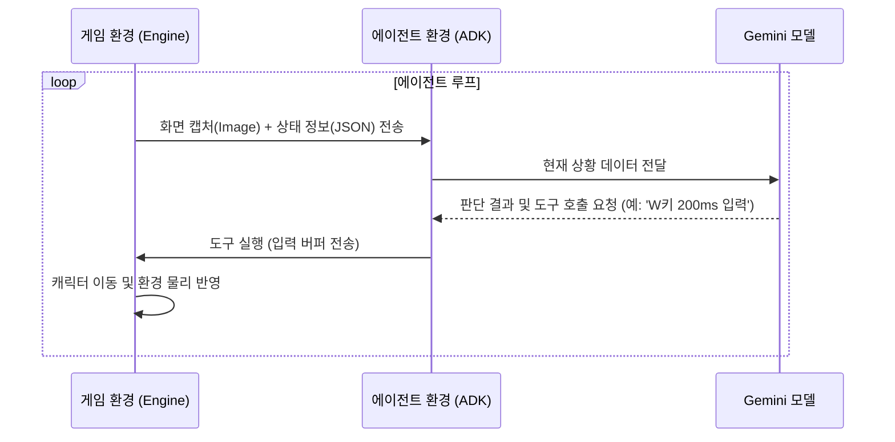
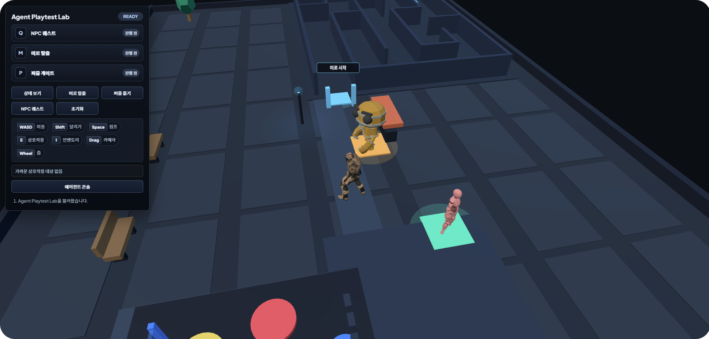

<h1 align="center">Agentic Game Lab</h1>

이 실습에서는 Google ADK와 Gemini API를 사용해 3D 게임 속 미션을 해결하는 AI 에이전트를 함께 만들어 보려 합니다. 에이전트가 캐릭터의 위치 데이터를 직접 읽는 방식이 아니라, 사람이 게임을 하듯 화면과 텍스트 정보만으로 스스로 판단하고 움직이게 만드는 것이 목표예요.

그럼 우리가 이 실습을 통해 어떤 것들을 얻을 수 있을지 하나씩 살펴볼까요?

### 화면을 보고 상황을 판단하는 법
게임 화면과 이벤트 로그를 Gemini 모델에 전달해서, 에이전트가 현재 어떤 상황인지 스스로 이해하도록 구성하는 과정을 배웁니다.

### 도구로 캐릭터를 직접 움직이는 법
모델이 내린 판단을 WASD나 E 같은 실제 키 입력으로 바꾸는 방법을 알아봅니다. 특정 좌표 이동 대신, 일정 시간 동안 키를 누르는 입력 버퍼 방식을 사용해 실제 플레이어처럼 정교하게 조작해 봅시다.

### 에이전트의 생각을 들여다보는 법
실행 중인 에이전트가 지금 무슨 생각을 하는지, 어떤 도구를 왜 썼는지 웹 콘솔로 실시간 확인하는 방법을 익힙니다.

## 우리 시스템은 어떻게 작동할까요?
에이전트와 게임 엔진은 실제 플레이어가 조작하는 것과 비슷한 루프를 돌며 데이터를 주고받습니다. 아래 구조를 보면서 흐름을 이해해 봅시다.


에이전트 시스템은 크게 두 가지 흐름으로 게임 환경과 상호작용해요.
1. **게임 정보 수집**: 3D 게임 엔진으로부터 실시간 화면과 퀘스트 상태 정보를 받아 현재 상황을 인지합니다.
2. **게임 조작 실행**: 수집된 정보를 분석한 뒤 키보드나 카메라 조작 명령을 엔진으로 전달하여 캐릭터를 움직입니다.

---

## 프로젝트 소개
Google ADK는 인공지능 모델이 다양한 도구를 사용해 스스로 작업을 수행할 수 있게 돕는 프레임워크입니다. 이번 실습에서는 Gemini 모델의 멀티모달 능력을 활용해 게임 플레이를 자동화하고 검증하는 과정을 함께해 봅시다.

### 에이전트란 무엇일까요?
ADK에서 에이전트를 만들 때는 어떤 모델을 쓸지, 어떤 지침을 줄지, 그리고 어떤 도구를 쥐여줄지를 결정해야 합니다. 아래 예시 코드를 보면서 구조를 익혀볼까요?

```python
# ADK를 활용한 에이전트 정의 예시
agent = LlmAgent(
    model="gemini-3-flash-preview",
    instruction="당신은 게임 테스터입니다. 화면과 상태 정보를 분석하여 주어진 미션을 자율적으로 수행하세요.",
    tools=[build_mcp_toolset(), exit_loop]
)
```

이 코드는 에이전트의 '눈(지각 능력)'과 '손(도구)'을 연결해 주는 역할을 합니다. 각 설정이 어떤 의미인지 알아봅시다.

- **model**: 에이전트가 상황을 분석할 때 사용하는 인공지능 모델입니다.
- **instruction**: 에이전트에게 내리는 행동 지침이에요. 어떤 규칙을 지키며 미션을 수행할지 정의합니다.
- **tools**: 에이전트가 쓸 수 있는 함수 목록입니다. 상황에 맞춰 에이전트가 이 도구들을 스스로 골라 사용하게 됩니다.

### 게임에서 AI는 어떻게 활용될까요?
모든 게임 경로를 사람이 직접 테스트하는 것은 쉽지 않은 일이죠. 이때 자율 에이전트가 있으면 큰 도움이 됩니다.

- **화면을 직접 보고 이해해요**: Gemini 모델은 게임 화면을 직접 보고 상황을 판단합니다. UI가 바뀌거나 시각적인 문제가 생겨도 사람처럼 감지할 수 있어요.
- **쉬지 않고 테스트합니다**: 설정된 시나리오에 따라 미로를 탐색하거나 퀘스트를 수행하며 예외 상황을 찾아냅니다.
- **변화에 유연하게 대응해요**: 게임 규칙이 조금 바뀌어도 지침만 수정하면 에이전트가 새로운 환경에 금방 적응합니다.

### 시스템은 어떻게 통신할까요?
에이전트와 게임 엔진은 서로 독립적으로 작동하며, 표준 인터페이스를 통해 데이터를 주고받습니다. 에이전트가 실제 사용자처럼 제한된 정보(화면, 로그)만으로 조작하는 과정을 시퀀스 다이어그램으로 살펴봅시다.



## 4인 에이전트 협업 시스템
복잡한 게임 환경을 더 효율적으로 테스트하기 위해, 우리는 4개의 전문 에이전트가 팀을 이루어 일하는 구조를 만들었습니다.


각 에이전트가 어떤 역할을 맡고 있는지 확인해 볼까요?

| 에이전트 | 역할 | 모델 | 담당 업무 |
| :--- | :--- | :--- | :--- |
| **관측자** | 데이터 수집 | Gemini 3 Flash | 화면을 캡처하고 거리나 장애물 정보를 데이터로 정리해 보고합니다. |
| **전략가** | 작전 설계 | Gemini 3.1 Pro | 관측 데이터를 바탕으로 최적의 이동 경로와 물리 상수를 계산합니다. |
| **행동가** | 액션 실행 | Gemini 3 Flash | 설계된 전략에 맞춰 키를 누르고 물리적인 충돌에 대응합니다. |
| **감독자** | 지휘 및 검증 | Gemini 3.1 Pro, Gemini 3 Flash | 전체 흐름을 지휘하며, 정체된 상황이 생기면 전략을 수정하도록 지시합니다. |

---

### 전략 수정 메커니즘 (5턴 주기)
에이전트가 한곳에서 계속 헤매는 것을 막기 위해, 우리는 정기적으로 상태를 확인하고 전략을 고치는 기능을 넣었습니다.

*   **정체 감지**: 감독자 에이전트는 5턴마다 캐릭터가 제대로 움직이고 있는지 확인합니다.
*   **전략 수정**: 진전이 없다고 판단되면 현재 전략을 포기하고 전략가에게 새로운 계획을 세우라고 지시해요.
*   **실패 기록**: 전략가는 막혔던 길을 기억해 두었다가 다음에는 다른 길을 선택하도록 설계합니다.

---

### 에이전트 도구 분류
에이전트는 각자의 전문 분야에 맞춰 아래 도구들을 활용합니다.

| 분류 | 도구 명칭 | 기능 설명 |
| :--- | :--- | :--- |
| **관측** | `inspect_game_state` | 실시간 스크린샷 캡처, 캐릭터 좌표, 주변 장애물 정보 수집 |
| **조작** | `apply_input_buffer` | 키보드 입력(WASD, Shift, Space, E) 전송 및 캐릭터 조작 |
| | `adjust_camera_view` | 카메라 각도와 줌을 변경하여 사각지대 탐색 및 정보 수집 |
| **관리** | `save_memory` | 발견한 경로, 전략 수정 사항 등을 작업 기억에 기록 |
| | `exit_loop` | 목표 달성 또는 진행 불가능 시 에이전트 루프 종료 |

---

### 실습 기대 결과
에이전트 구축이 완료되면 다음 3가지 QA 미션을 자율적으로 수행하게 됩니다.


*   **미로 탈출**: 복잡한 지형지물을 파악하고 최단 경로를 찾아 탈출합니다.
*   **NPC 퀘스트**: 대화 맥락을 이해하고 아이템을 활용하여 NPC의 요구사항을 해결합니다.
*   **퍼즐 풀기**: 시각적 패턴을 분석하여 퍼즐의 규칙을 찾아내고 조작합니다.

---

## 준비 및 환경 설정

게임 서버와 에이전트 런타임을 로컬 환경에서 실행하기 위한 설정 단계입니다.

### 프로젝트 내부 구조와 실행 흐름
우리가 수정할 파일은 에이전트의 구성을 정의하는 설정 부분이에요. 실제 동작을 제어하는 로직은 `src/engine/game` 디렉토리에 들어있습니다. 전체적인 흐름을 이해하기 위해 주요 파일들이 어떤 역할을 하는지 살펴볼까요?

| 디렉토리 / 파일 | 역할 | 상세 설명 |
| :--- | :--- | :--- |
| **handson/** | **실습 공간** | 에이전트의 제어 루프와 도구 목록을 정의하는 공간이에요. |
| └ game_agent/agent.py | 에이전트 구성 | 에이전트의 인자값을 설정해 동작 방식을 결정하는 곳입니다. |
| **src/engine** | **주요 로직** | 에이전트를 실행하고 게임 물리 연산을 담당하는 내부 구현부입니다. |
| └ game/adk_controller.py | 실행 제어기 | 에이전트의 실행 상태를 관리하고 통신을 담당합니다. |
| └ game/simulation.py | 시뮬레이션 연산 | 게임 속 물리 법칙과 캐릭터의 상태 변화를 계산해요. |
| └ mcp_server.py | 도구 인터페이스 | 에이전트의 명령을 게임 엔진 API로 바꿔줍니다. |

**데이터는 어떻게 흐를까요?**
1. `run_game.py`를 실행하면 `handson/game_agent/agent.py`의 설정을 먼저 읽어옵니다.
2. `adk_controller.py`가 이 설정을 바탕으로 ADK 런타임을 가동해요.
3. 게임 속 시각 데이터와 상태 정보가 `simulation.py`를 통해 에이전트에게 전달됩니다.
4. 에이전트가 내린 결정은 `mcp_server.py`를 거쳐 다시 게임 속 동작으로 반영됩니다.

### 프로젝트 환경 구축해 보기
자, 이제 우리만의 독립적인 파이썬 가상환경을 만들어 볼까요? 터미널을 열고 아래 명령어를 입력해 보세요.

```bash
python -m venv .venv
```

가상환경이 만들어졌다면, 이제 이 환경을 활성화해 줄 차례입니다. 운영체제에 맞춰 아래 명령어 중 하나를 실행해 봅시다.

```bash
source .venv/bin/activate  # Linux/macOS
# .venv\Scripts\activate  # Windows
```

준비가 다 되셨나요? 마지막으로 실습에 필요한 라이브러리들을 한꺼번에 설치해 보겠습니다.

```bash
pip install -r requirements.txt
```

### 환경 변수 설정 (.env)
에이전트가 Gemini 모델과 통신하여 데이터를 분석하려면 인증을 위한 API 키가 필요합니다. 프로젝트 최상단 경로에 `.env` 파일을 생성하고 본인의 API 키를 아래와 같은 형식으로 저장합니다.
```env
GOOGLE_API_KEY=여러분의_Gemini_API_KEY
```

### 실행 및 확인
환경 설정이 모두 끝났다면 `python run_game.py` 명령어를 입력해 전체 시스템을 실행해 봅시다.

```bash
python run_game.py
```

> [!TIP]
> 정답 코드로 에이전트가 동작하는 모습을 먼저 보고 싶다면 `python run_game.py solution` 명령어를 실행하세요. 다시 실습 모드로 돌아오려면 `python run_game.py handson`을 입력하면 됩니다.
서버 가동 후 터미널에 아래와 같은 로그가 정상적으로 출력되는지 확인해 보세요. 특히 마지막 줄의 `Uvicorn running on...` 메시지는 시스템이 명령을 받을 준비가 되었다는 신호입니다.
```text
INFO:     Started server process [12345]
INFO:     Waiting for application startup.
INFO:     Application startup complete.
INFO:     Uvicorn running on http://127.0.0.1:8787
```
로그를 확인했다면 이제 브라우저에서 `http://127.0.0.1:8787` 주소에 접속해 봅시다. 화면 좌측 상단에 있는 입력창에 "미로를 탈출해줘"와 같은 명령어를 직접 입력하고 Enter를 눌러 보세요.



### 에러 로그 확인 및 원인 파악
명령어를 입력해 보셨나요? 아마 터미널에는 아래와 같은 `ValidationError`가 발생하며 에이전트가 움직이지 않을 것입니다.
```text
pydantic_core._pydantic_core.ValidationError: 2 validation errors for LoopAgent
sub_agents.0
  Input should be a valid dictionary or instance of BaseAgent [type=model_type, input_value=Ellipsis, input_type=ellipsis]
max_iterations
  Input should be a valid integer [type=int_type, input_value=Ellipsis, input_type=ellipsis]
```
이 에러는 우리가 수정해야 할 `handson/game_agent/agent.py` 파일 내 설정값이 아직 비어 있기 때문에 발생하는 지극히 정상적인 현상입니다. 자, 이제 이 에러를 하나씩 지워나가며 에이전트의 구성을 직접 완성해 봅시다.

---

## 핸즈온 가이드: 에이전트 제어 루프와 도구 연결

실습 파일인 `handson/game_agent/agent.py`를 수정하여 에이전트의 동작 환경을 완성해 보겠습니다. 현재 서버는 정상적으로 실행되지만 에이전트 구성이 완료되지 않아 사용자의 명령을 수행할 수 없는 상태입니다. 각 단계를 따라가며 에이전트에 제어 루프를 설정하고 조작 도구를 연결해 보겠습니다.

> [!IMPORTANT]
> 프로젝트의 모든 API 키와 설정 정보는 워크스페이스 최상단 루트에 위치한 .env 파일 하나에서만 관리합니다. 하위 폴더에 있는 설정 파일은 사용되지 않으므로 루트 파일의 내용을 반드시 확인하시기 바랍니다.

---

### 제어 루프 설정

에이전트가 단발성 판단에 그치지 않고 목표를 달성할 때까지 관찰과 행동을 반복하게 하려면 제어 루프 설정을 완성해야 합니다.

먼저 build_loop_agent 함수를 살펴보면 작업을 수행할 하위 에이전트 목록이 비어 있고 반복 횟수도 1회로 제한되어 있습니다. 이 상태로는 명령을 받자마자 실행이 종료되어 자율적인 동작이 불가능합니다.

```python
def build_loop_agent(model=DEFAULT_MODEL):
    # 단계 1: 실행 에이전트 등록
    # LoopAgent는 등록된 하위 에이전트에게 실제 작업을 위임하고 실행 과정을 관리합니다.
    return LoopAgent(
        name="게임_에이전트_루프",
        sub_agents=[
            # TODO: 실제 조작을 담당하는 실행 에이전트를 추가하세요.
            build_controller_agent(model=model)
        ],
        
        # 단계 2: 반복 횟수 설정
        # 에이전트가 목표 달성을 위해 충분히 시도할 수 있도록 횟수를 지정합니다.
        # 무한 실행을 방지하기 위해 최대 반복 횟수를 15회로 설정합니다.
        max_iterations=15, 
    )
```

제어 루프는 하위 에이전트가 작업을 완료하거나 지정된 횟수에 도달할 때까지 실행을 유지하는 역할을 수행합니다. 상세한 기술 규격은 Google ADK 에이전트 가이드 페이지에서 확인할 수 있습니다.

---

### 실행 에이전트와 도구 연결

에이전트가 게임 환경을 분석하고 캐릭터를 조작하려면 모델 정보와 조작 도구를 연결해야 합니다.

build_controller_agent 함수에서 에이전트가 사용할 도구 목록이 비어 있으면 모델이 판단을 내려도 엔진에 명령을 전달할 수 없습니다. 따라서 에이전트가 환경에 개입할 수 있는 통로를 열어주어야 합니다.

```python
def build_controller_agent(model=DEFAULT_MODEL):
    # 단계 3: 도구 연결
    # 에이전트가 엔진과 통신하며 상호작용하기 위해 필요한 도구들을 등록합니다.
    return LlmAgent(
        model=model,
        instruction=CONTROLLER_INSTRUCTION,
        tools=[
            # 게임 엔진 도구셋과 루프 종료 도구를 리스트에 추가합니다.
            build_mcp_toolset(), 
            exit_loop
        ],
    )
```

이 과정은 언어 모델의 추론 결과를 실제 게임 내의 물리적 변화로 연결하는 필수 단계입니다. 에이전트는 설정된 도구들을 활용해 엔진으로부터 데이터를 읽어오거나 명령을 전송하게 됩니다.

---

### 통신 서버 실행 인자 설정

에이전트와 게임 엔진 사이의 통신을 담당하는 도구 서버의 실행 방식을 지정합니다. 파이썬 환경에서 특정 파일을 모듈 단위로 인식하여 안정적으로 구동하기 위한 과정입니다.

```python
# 단계 4: 실행 인자 구성
# 파이썬의 모듈 실행 옵션인 -m과 정의된 서버 모듈 경로를 사용합니다.
args=["-m", MCP_SERVER_MODULE],
```

실행 인자에 -m 옵션을 포함하면 파이썬이 전체 패키지 구조 내에서 모듈을 올바르게 탐색하므로 경로 관련 오류를 방지할 수 있습니다.

---

### 실행 결과를 함께 분석해 볼까요?
모든 설정을 마쳤다면 이제 서버를 재시작해 보세요. 그리고 에이전트 콘솔에 "미로를 탈출해 봐" 같은 명령을 입력해 봅시다. 터미널에 모델이 상황을 분석하는 과정이 뜨는지 확인하면서, 브라우저 화면에서 캐릭터가 장애물을 피해 움직이는 모습을 관찰해 보세요.

실습이 잘 끝났다면, 에이전트 콘솔에서 모델이 왜 그런 판단을 내렸는지, 어떤 도구를 썼는지 상세히 보실 수 있을 거예요. 에이전트가 목표를 달성하고 스스로 루프를 종료하는지 확인하면서 즐겁게 실습을 마무리해 봅시다! 짝짝짝!

---

## 참고 자료

- [Google ADK 공식 문서](https://ai.google.dev/gemini/docs/agents): 에이전트 설계 및 도구 활용 안내
- [MCP 개요](https://modelcontextprotocol.io/): 에이전트와 외부 도구 사이의 통신 규약
- [제미나이 API 가이드](https://ai.google.dev/gemini/docs): 모델 활용 및 동작 지침 최적화 방법
