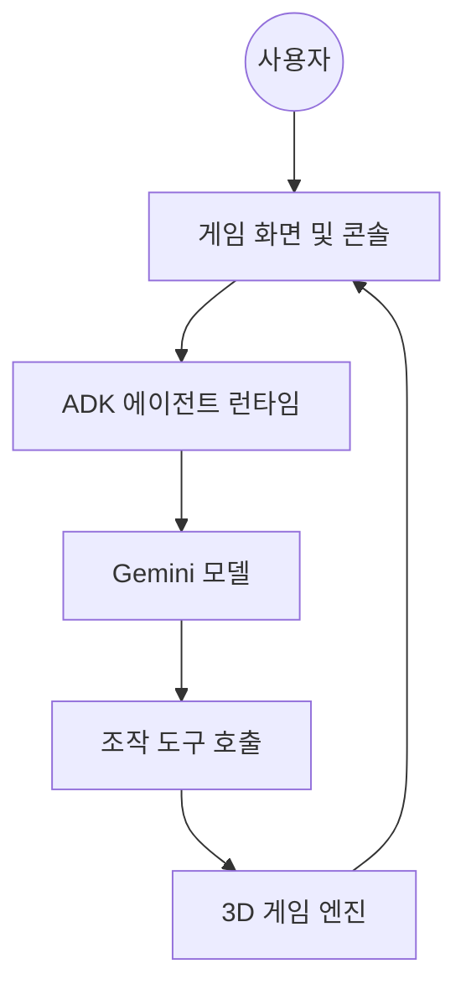
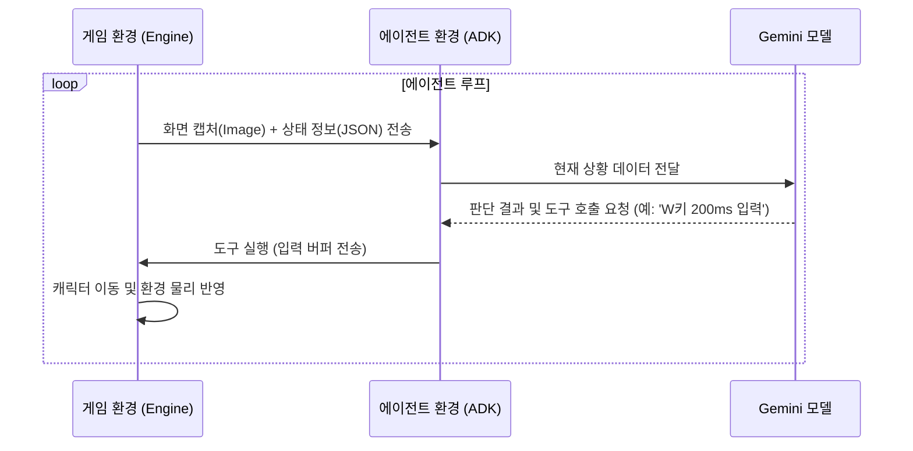

# build-game-with-ai: AI 에이전트 기반 게임 플레이테스트

이 실습은 Google ADK와 Gemini API를 활용하여 3D 게임 환경에서 미션을 수행하는 AI 에이전트를 구축하고 검증하는 과정입니다. 에이전트는 캐릭터의 좌표 데이터 등에 직접 접근하지 않고, 사람이 게임을 하는 것과 같이 화면 이미지와 텍스트 상태 정보만을 사용하여 스스로 판단하고 움직입니다.

## 실습 목표

이 실습을 완료하면 다음 세 가지 핵심 기술을 습득할 수 있습니다.

### 시각 및 상태 정보를 통한 상황 판단
게임 실행 환경에서 캡처한 화면 이미지와 최근에 발생한 이벤트 로그를 Gemini 모델에 전달하여, 모델이 현재 미션의 진행 상태를 파악하도록 설정하는 과정을 배웁니다.

### 도구를 활용한 캐릭터 조작
모델이 내린 판단을 실제 게임 내의 키보드 입력(WASD, E 등)으로 변환하는 방법을 배웁니다. 특정 좌표로 바로 이동하는 기능 대신, 일정 시간 동안 특정 키를 누르는 입력 버퍼 방식을 사용하여 실제 플레이어와 동일한 제어 환경을 구성하는 법을 익힙니다.

### 사고 과정의 추적 및 분석
에이전트가 실행되는 동안 웹 콘솔을 통해 모델이 분석한 데이터와 판단 내용, 그리고 실행된 도구의 목록을 실시간으로 확인하고 분석하는 방법을 익힙니다.

## 시스템 동작 구조

에이전트와 게임 엔진은 아래와 같은 흐름으로 데이터를 주고받으며 작동합니다.



---

## 프로젝트 소개

Google ADK(Agent Development Kit)는 대규모 언어 모델(LLM)이 도구와 결합하여 자율적으로 작업을 수행하도록 돕는 프레임워크입니다. 본 프로젝트에서는 Gemini 모델의 멀티모달(Multi-modal) 능력을 활용하여 게임 플레이를 자동화하고 검증하는 과정을 실습합니다.

### 에이전트

ADK에서는 에이전트를 정의할 때 사용할 모델, 행동 지침, 그리고 에이전트가 조작할 수 있는 도구 목록을 명시합니다. 아래는 에이전트를 정의하는 일반적인 코드 형태입니다.

```python
# ADK를 활용한 에이전트 정의 예시
agent = LlmAgent(
    model="gemini-3-flash-preview",
    instruction="당신은 게임 테스터입니다. 화면을 보고 미로를 탈출하세요.",
    tools=[inspect_game_state, apply_input_buffer]
)
```

이처럼 ADK는 에이전트가 어떤 지각 능력을 가질지, 그리고 어떤 도구를 사용하여 환경에 간섭할지를 코드로 연결해 주는 역할을 수행합니다. 각 항목의 의미는 다음과 같습니다.

- **model**: 에이전트가 상황을 분석하고 판단할 때 사용할 **인공지능 모델**을 지정합니다. 본 실습에서는 이미지와 텍스트를 동시에 이해할 수 있는 멀티모달 모델인 Gemini를 사용합니다.
- **instruction**: 에이전트에게 내리는 **행동 지침(시스템 프롬프트)**입니다. 에이전트가 어떤 페르소나를 가져야 하는지, 어떤 규칙을 지키며 미션을 수행해야 하는지를 정의합니다.
- **tools**: 에이전트가 상황에 맞춰 호출할 수 있는 **함수들의 목록**입니다. 캐릭터를 조작하거나 상태를 읽어오는 도구들을 연결해 주면, 에이전트는 판단에 따라 이 도구들을 스스로 선택하여 실행합니다.

### 게임에서 AI의 활용

인디 게임 개발이나 소규모 프로젝트에서 게임의 모든 경로를 사람이 직접 테스트하는 것은 리소스 측면에서 매우 어려운 일입니다. 이때 자율 에이전트는 다음과 같은 가치를 제공합니다.

- **멀티모달 기반의 상황 이해**: 기존의 스크립트 기반 봇과 달리, Gemini 모델은 게임 화면(이미지)을 직접 보고 상황을 판단합니다. 이는 UI 레이아웃의 변화나 시각적 버그를 사람이 인지하는 것과 유사한 방식으로 감지할 수 있음을 의미합니다.
- **24/7 자동화 테스트**: 에이전트는 개발자가 설정한 시나리오에 따라 미로를 탐색하거나 퀘스트를 수행하며, 사람이 놓치기 쉬운 예외 상황을 지속적으로 테스트합니다.
- **유연한 대응**: 게임 규칙이 일부 변경되더라도 시스템 프롬프트(Instruction)만 수정하면 에이전트가 새로운 환경에 맞춰 행동을 최적화할 수 있습니다.

### 시스템 통신 구조

에이전트 환경과 게임 환경은 서로 독립적으로 작동하며, 표준 인터페이스를 통해 데이터를 주고받습니다. 에이전트는 실제 사용자와 동일하게 제한된 정보(화면 캡처, 최근 이벤트 로그)만을 받아 조작을 수행하는 것을 목표로 합니다.



### 에이전트 구성요소

실습에서 에이전트가 실제로 사용하는 클래스와 도구들의 역할입니다.

| 항목 | 명칭 | 상세 역할 |
| :--- | :--- | :--- |
| **LoopAgent** | 관리 에이전트 | 미션 완료 시까지 하위 에이전트를 반복 실행하며 루프 횟수를 제어합니다. |
| **LlmAgent** | 실행 에이전트 | 멀티모달 데이터를 분석하여 어떤 도구를 사용할지 최종 결정합니다. |
| **inspect_game_state** | 상태 조회 도구 | 캐릭터의 좌표, 인벤토리, 주변 장애물 정보를 텍스트로 조회합니다. |
| **apply_input_buffer** | 입력 조작 도구 | `WASD`, `E` 등의 키를 특정 시간 동안 누르는 실제 조작을 수행합니다. |
| **exit_loop** | 종료 도구 | 에이전트가 스스로 목표 달성을 판단했을 때 루프를 빠져나오기 위해 사용합니다. |

### 게임 환경 및 조작 방법

본 실습에서 사용되는 게임은 웹 브라우저 기반의 3D 시뮬레이션 환경입니다. 에이전트를 구축하기 전에 직접 캐릭터를 조작하며 환경을 익혀보세요.

- **기술 구성**: FastAPI 기반의 통신 서버와 3D 웹 렌더링 엔진으로 구성되어 있습니다. 에이전트에게 현재 화면을 이미지로 전송하고, 에이전트로부터 전달받은 키보드 입력 명령을 물리 법칙에 따라 처리합니다.

| 조작키 | 기능 | 상세 설명 |
| :--- | :--- | :--- |
| **W, A, S, D** | 캐릭터 이동 | 전후좌우로 캐릭터를 움직입니다. |
| **Shift** | 전력 질주 | 이동 중에 누르면 이동 속도가 빨라집니다. |
| **E** | 상호작용 | NPC 대화, 아이템 획득, 퍼즐 발판 밟기 등을 수행합니다. |
| **R** | 시점 초기화 | 카메라 위치와 각도를 기본값으로 되돌립니다. |

### 실습 기대 결과

이 실습을 모두 마치면, 여러분이 구축한 에이전트는 다음과 같은 수준의 자율 행동을 수행하게 됩니다.

| 미션 유형 | 에이전트의 자율 행동 | 기대 결과 |
| :--- | :--- | :--- |
| **미로 탈출** | 화면 캡처 이미지에서 길과 벽을 구분하고, 상태 정보를 통해 받은 충돌 데이터를 분석합니다. | 막힌 길을 우회하여 스스로 탈출구까지 이동합니다. |
| **기억 퍼즐** | 특정 발판이 반짝이는 순서를 시각적으로 기억한 뒤, 이를 정확한 순서로 다시 밟습니다. | 사람이 조작하지 않아도 시각적 패턴을 복기하여 퍼즐을 해결합니다. |
| **NPC 퀘스트** | 대화 로그에서 NPC의 요구 사항을 파악하고, 주변 환경에서 해당 아이템을 찾아 전달합니다. | 텍스트 맥락을 이해하고 아이템 획득과 전달이라는 연속된 작업을 완수합니다. |
| **디버깅 분석** | 에이전트가 실수했을 때, Trace 탭에서 당시 에이전트가 본 이미지와 판단 내용을 대조합니다. | AI의 판단 오류 원인이 이미지 인식 실패인지 지침 위반인지 논리적으로 판별합니다. |

---

## 준비 및 환경 설정

게임 서버와 에이전트 런타임을 로컬 환경에서 실행하기 위한 설정 단계입니다.

### 프로젝트 내부 구조 및 실행 흐름

실습생이 수정하는 파일은 에이전트의 구성을 정의하는 설정부이며, 실제 동작을 제어하는 핵심 로직은 `src/agentic_game_engine/game` 디렉토리에 위치합니다. 전체적인 시스템 흐름을 이해하기 위해 주요 파일의 역할을 파악하는 것이 중요합니다.

| 디렉토리 / 파일 | 역할 | 상세 설명 |
| :--- | :--- | :--- |
| **handson/** | **실습 공간** | 에이전트의 제어 루프와 도구 목록을 정의하는 설정 공간입니다. |
| └ agent_setup.py | 에이전트 구성 정의 | LoopAgent와 LlmAgent의 인자값을 설정하여 동작 방식을 결정합니다. |
| **src/agentic_game_engine** | **핵심 로직** | 에이전트 실행 및 게임 물리 연산을 담당하는 내부 구현부입니다. |
| └ game/adk_controller.py | 실행 제어기 | ADK 런타임과 통신하며 에이전트의 실행 상태를 관리합니다. |
| └ game/simulation.py | 시뮬레이션 연산 | 게임 내 물리 법칙과 캐릭터의 상태 변화를 계산합니다. |
| └ mcp_server.py | 도구 인터페이스 | 에이전트가 호출하는 명령을 게임 엔진 API로 변환합니다. |

**데이터 처리 흐름**:
1. `run_demo.py`가 실행되면 `agent_setup.py`에 정의된 에이전트 설정을 읽어옵니다.
2. `adk_controller.py`는 이 설정을 바탕으로 ADK 런타임을 가동합니다.
3. 게임 내의 시각 데이터와 상태 정보는 `simulation.py`를 통해 추출되어 에이전트에게 전달됩니다.
4. 에이전트가 내린 결정은 `mcp_server.py`를 거쳐 다시 게임 엔진의 동작으로 반영됩니다.

### 프로젝트 환경 구축
본 실습은 시스템 환경과 분리된 독립적인 파이썬 가상환경에서 진행하는 것을 권장합니다. 먼저 터미널을 열고 아래 명령어를 입력하여 가상환경 폴더를 생성합니다.
```bash
python -m venv .venv
```
가상환경이 생성되었다면 현재 터미널 세션에 이를 적용하기 위한 활성화 작업이 필요합니다. 사용하는 운영체제에 맞춰 아래 명령어 중 하나를 실행합니다.
```bash
source .venv/bin/activate  # Linux/macOS
# .venv\Scripts\activate  # Windows
```
가상환경이 활성화된 상태에서 프로젝트 수행에 필요한 필수 라이브러리들을 설치합니다. `requirements.txt` 파일에 명시된 패키지들을 `pip`을 통해 일괄 설치합니다.
```bash
pip install -r requirements.txt
```

### 환경 변수 설정 (.env)
에이전트가 Gemini 모델과 통신하여 데이터를 분석하려면 인증을 위한 API 키가 필요합니다. 프로젝트 최상단 경로에 `.env` 파일을 생성하고 본인의 API 키를 아래와 같은 형식으로 저장합니다.
```env
GOOGLE_API_KEY=여러분의_Gemini_API_KEY
```

### 실행 및 확인
환경 설정이 모두 끝났다면 `python run_demo.py` 명령어를 입력해 전체 시스템을 실행해 봅시다.
```bash
python run_demo.py
```
서버 가동 후 터미널에 아래와 같은 로그가 정상적으로 출력되는지 확인해 보세요. 특히 마지막 줄의 `Uvicorn running on...` 메시지는 시스템이 명령을 받을 준비가 되었다는 신호입니다.
```text
INFO:     Started server process [12345]
INFO:     Waiting for application startup.
INFO:     Application startup complete.
INFO:     Uvicorn running on http://127.0.0.1:8787
```
로그를 확인했다면 이제 브라우저에서 `http://127.0.0.1:8787` 주소에 접속해 봅시다. 화면 좌측 상단에 있는 입력창에 "미로를 탈출해줘"와 같은 명령어를 직접 입력하고 Enter를 눌러 보세요.

### 에러 로그 확인 및 원인 파악
명령어를 입력해 보셨나요? 아마 터미널에는 아래와 같은 `ValidationError`가 발생하며 에이전트가 움직이지 않을 것입니다.
```text
pydantic_core._pydantic_core.ValidationError: 2 validation errors for LoopAgent
sub_agents.0
  Input should be a valid dictionary or instance of BaseAgent [type=model_type, input_value=Ellipsis, input_type=ellipsis]
max_iterations
  Input should be a valid integer [type=int_type, input_value=Ellipsis, input_type=ellipsis]
```
이 에러는 우리가 수정해야 할 `agent_setup.py` 파일 내 설정값이 아직 비어 있기 때문에 발생하는 지극히 정상적인 현상입니다. 자, 이제 이 에러를 하나씩 지워나가며 에이전트의 구성을 직접 완성해 봅시다.

---

## 핸즈온 가이드: 에이전트 제어 루프와 도구 연결

실습 파일인 agent_setup.py를 수정하여 에이전트의 동작 환경을 완성해 보겠습니다. 현재 서버는 정상적으로 실행되지만 에이전트 구성이 완료되지 않아 사용자의 명령을 수행할 수 없는 상태입니다. 각 단계를 따라가며 에이전트에 제어 루프를 설정하고 조작 도구를 연결해 보겠습니다.

> [!IMPORTANT]
> 프로젝트의 모든 API 키와 설정 정보는 워크스페이스 최상단 루트에 위치한 .env 파일 하나에서만 관리합니다. 하위 폴더에 있는 설정 파일은 사용되지 않으므로 루트 파일의 내용을 반드시 확인하시기 바랍니다.

---

### 제어 루프 설정

에이전트가 단발성 판단에 그치지 않고 목표를 달성할 때까지 관찰과 행동을 반복하게 하려면 제어 루프 설정을 완성해야 합니다.

먼저 build_loop_agent 함수를 살펴보면 작업을 수행할 하위 에이전트 목록이 비어 있고 반복 횟수도 1회로 제한되어 있습니다. 이 상태로는 명령을 받자마자 실행이 종료되어 자율적인 동작이 불가능합니다.

```python
def build_loop_agent(model, runtime_url):
    # 단계 1: 실행 에이전트 등록
    # LoopAgent는 등록된 하위 에이전트에게 실제 작업을 위임하고 실행 과정을 관리합니다.
    sub_agents=[
        # TODO: 실제 조작을 담당하는 실행 에이전트인
        # build_controller_agent(model=model, runtime_url=runtime_url)를 추가하세요.
    ],
    
    # 단계 2: 반복 횟수 설정
    # 에이전트가 목표 달성을 위해 충분히 시도할 수 있도록 횟수를 지정합니다.
    # 무한 실행을 방지하기 위해 최대 반복 횟수를 15회로 설정합니다.
    max_iterations=15, 
```

제어 루프는 하위 에이전트가 작업을 완료하거나 지정된 횟수에 도달할 때까지 실행을 유지하는 역할을 수행합니다. 상세한 기술 규격은 Google ADK 에이전트 가이드 페이지에서 확인할 수 있습니다.

---

### 실행 에이전트와 도구 연결

에이전트가 게임 환경을 분석하고 캐릭터를 조작하려면 모델 정보와 조작 도구를 연결해야 합니다.

build_controller_agent 함수에서 에이전트가 사용할 도구 목록이 비어 있으면 모델이 판단을 내려도 엔진에 명령을 전달할 수 없습니다. 따라서 에이전트가 환경에 개입할 수 있는 통로를 열어주어야 합니다.

```python
def build_controller_agent(model, runtime_url):
    # 단계 3: 도구 연결
    # 에이전트가 엔진과 통신하며 상호작용하기 위해 필요한 도구들을 등록합니다.
    return LlmAgent(
        model=model,
        instruction=CONTROLLER_INSTRUCTION,
        tools=[
            # 게임 엔진 도구셋과 루프 종료 도구를 리스트에 추가합니다.
            build_mcp_toolset(runtime_url), 
            exit_loop
        ],
    )
```

이 과정은 언어 모델의 추론 결과를 실제 게임 내의 물리적 변화로 연결하는 필수 단계입니다. 에이전트는 설정된 도구들을 활용해 엔진으로부터 데이터를 읽어오거나 명령을 전송하게 됩니다.

---

### 통신 서버 실행 인자 설정

에이전트와 게임 엔진 사이의 통신을 담당하는 도구 서버의 실행 방식을 지정합니다. 파이썬 환경에서 특정 파일을 모듈 단위로 인식하여 안정적으로 구동하기 위한 과정입니다.

```python
# 단계 4: 실행 인자 구성
# 파이썬의 모듈 실행 옵션인 -m과 정의된 서버 모듈 경로를 사용합니다.
args=["-m", MCP_SERVER_MODULE],
```

실행 인자에 -m 옵션을 포함하면 파이썬이 전체 패키지 구조 내에서 모듈을 올바르게 탐색하므로 경로 관련 오류를 방지할 수 있습니다.

---

### 실행 결과 확인 및 분석

모든 설정을 마친 뒤 서버를 재시작하고 에이전트 콘솔에 미로 탈출과 같은 명령을 입력해 봅니다. 터미널에서 모델의 분석 과정이 출력되는지 확인하고 브라우저 화면에서 캐릭터가 장애물을 피해 이동하는지 관찰합니다.

실습이 정상적으로 완료되었다면 에이전트 콘솔의 데이터 흐름을 통해 모델의 상황 판단 근거와 도구 호출 내역을 상세히 분석할 수 있습니다. 에이전트가 목표를 달성한 후 작업을 스스로 종료하는지 확인하며 과정을 마무리합니다.

---

## 참고 자료

- [Google ADK 공식 문서](https://ai.google.dev/gemini/docs/agents): 에이전트 설계 및 도구 활용 안내
- [MCP 개요](https://modelcontextprotocol.io/): 에이전트와 외부 도구 사이의 통신 규약
- [제미나이 API 가이드](https://ai.google.dev/gemini/docs): 모델 활용 및 동작 지침 최적화 방법
